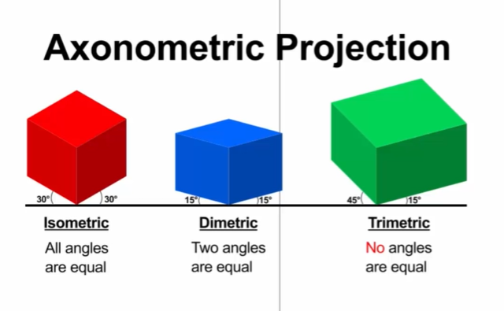

# Introduction
### i-so-met-ric
**adjective**
- of or having equal dimensions
---

### ax-o-no-met-ric
**adjective**
- using or designating an orthographic projection of an object, such as a building, on a plane inclined to each of the three principal axes of the object; three-dimensional but without prespective.

> "Axonometry" means "to measure along axes."
---

### Image
